# BÁO CÁO REQUIREMENT 6: PERFORMANCE TESTING

## Thông tin cá nhân

| **Thông tin** | **Chi tiết** |
| :--- | :--- |
| **Môn học** | Kiểm thử phần mềm (Software Testing) |
| **Đồ án** | OrangeHRM Case Study |
| **Sinh viên** | Trương Lê Anh Vũ |
| **MSSV** | 22120443 |
| **Nhóm** | 13 |

---

## Thông tin nhóm

| MSSV     | Họ và Tên        | Module                                                      | Feature / Work                                                                                                                                                                                                                                                                                                                                 |
| -------- | ---------------- | ----------------------------------------------------------- | ---------------------------------------------------------------------------------------------------------------------------------------------------------------------------------------------------------------------------------------------------------------------------------------------------------------------------------------------- |
| 22120376 | Nguyễn Đức Toàn  | Leave Management; Recruitment - Applicant Tracking          | Thực hiện Performance Testing (Load/Stress/Spike) cho chức năng thêm ứng viên (Add Candidate) bằng JMeter và API Testing cho API thêm ứng viên (Add Candidate) và API upload file đính kèm (Upload File) (49 test cases, 91,8% pass) bằng Postman. Áp dụng kỹ thuật Data-Driven và tạo báo cáo chi tiết.                                       |
| 22120430 | Lê Hoàng Việt    | HR Administration; Performance Management                   | Thực hiện Performance Testing (Load/Stress/Spike) cho Locations & KPIs API bằng JMeter và API Testing cho Locations API (34 test cases, 100% pass) bằng Postman. Áp dụng kỹ thuật Data-Driven và tạo báo cáo chi tiết.                                                                                                                         |
| 22120434 | Lê Thành Vinh    | PIM - Personnel Information Management; Time and Attendance | Thực hiện Performance Testing (Load/Stress/Spike) cho chức năng thêm nhân viên (Add Employee) bằng JMeter và API Testing cho API thêm nhân viên (Add Employee) bằng Postman. Áp dụng kỹ thuật Data-Driven và tạo báo cáo chi tiết.                                                                                                             |
| 22120443 | Trương Lê Anh Vũ | Reporting and Analytics; ESS - Employee Self-Service        | Triển khai kiểm thử hiệu năng (Load/Stress/Spike) cho luồng nghiệp vụ Xem ngày nghỉ phép (View My Leave) trên phân hệ ESS sử dụng JMeter và API Testing cho API Gửi yêu cầu nghỉ phép (Save Leave Request) (36 test cases, 100% pass) bằng Postman. Áp dụng kỹ thuật Data-Driven, kiểm thử bảo mật (Security Testing) và tạo báo cáo chi tiết. |

---

## Chi tiết chức năng và màn hình được phân công:
1.  **Reporting & Analytics**
2.  **Employee Self-Service (ESS)**

---

## 1. Tổng quan & Mục tiêu (Overview & Objectives)

Mục tiêu của báo cáo này là đánh giá hiệu năng (Performance) và độ ổn định (Stability) của hệ thống quản lý nhân sự **OrangeHRM** dưới các điều kiện tải khác nhau. Việc kiểm thử nhằm đảm bảo hệ thống đáp ứng được nhu cầu sử dụng thực tế của doanh nghiệp và xác định các điểm nghẽn (bottlenecks) tiềm ẩn.

Phạm vi kiểm thử tập trung vào chức năng **Employee Self-Service (ESS)** - cụ thể là luồng "Login và Xem ngày nghỉ phép", đây là phân hệ có tần suất truy cập cao nhất.

---

## 2. Môi trường Kiểm thử (Test Environment Setup)

Hệ thống System Under Test (SUT) được triển khai trên môi trường giả lập cục bộ (Localhost) để loại bỏ các yếu tố nhiễu từ mạng Internet.

### 2.1. Cấu hình Máy trạm (Host Machine Configuration)
Dưới đây là cấu hình phần cứng của máy chủ chạy Docker Container:

| Thành phần | Thông số kỹ thuật chi tiết |
| :--- | :--- |
| **Processor (CPU)** | Intel Core i7-10850H |
| **Memory (RAM)** | 16.0 GB DDR4 |
| **Operating System** | Windows 11 Pro 64-bit |
| **Server Container** | Docker Desktop (Engine v4.55.0) |
| **Testing Tool** | Apache JMeter 5.6.3 |

**Minh chứng cấu hình Server/PC:**
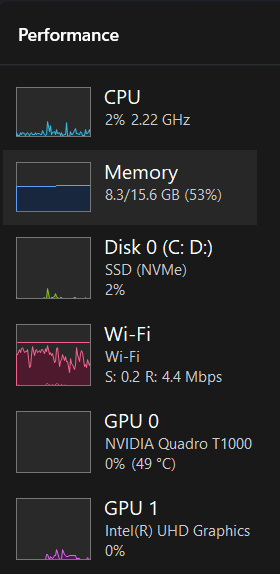

---

## 3. Chiến lược & Kỹ thuật Kiểm thử (Testing Strategy)

### 3.1. Kịch bản Kiểm thử (Test Scenario)
Kịch bản mô phỏng luồng nghiệp vụ tiêu chuẩn của nhân viên:
1.  **Login (HTTP POST):** Người dùng gửi credentials (username/password) để xác thực.
2.  **View Leave List (HTTP GET):** Truy cập trang danh sách ngày nghỉ phép.
3.  **Logout (HTTP GET):** Kết thúc phiên làm việc.

**Minh chứng cấu hình Request Login (Tham số hóa):**
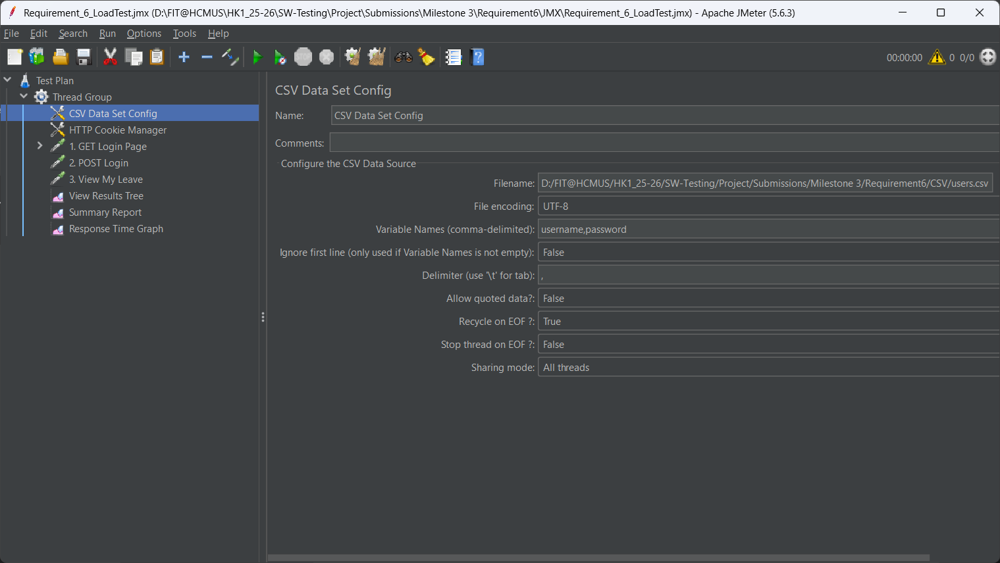

### 3.2. Kỹ thuật Data Driven Testing
Để đảm bảo tính trung thực, kịch bản KHÔNG sử dụng một tài khoản duy nhất mà sử dụng file `users.csv` chứa danh sách tài khoản test.
* **Config:** Sử dụng `CSV Data Set Config` với thiết lập `Recycle on EOF = True` để hỗ trợ Stress Test.

**Minh chứng cấu hình CSV Data Set Config:**
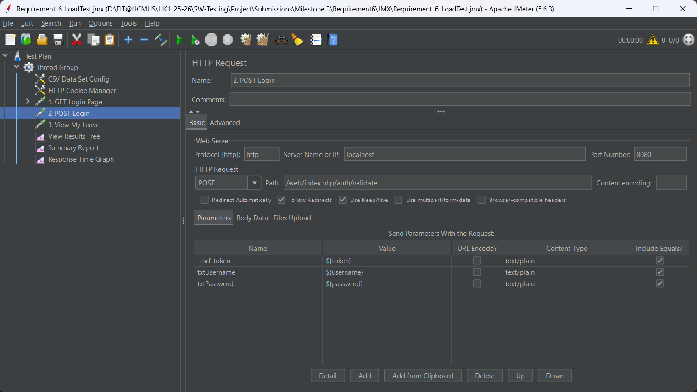

---

## 4. Thực thi & Phân tích Kết quả (Execution & Analysis)

### 4.1. Load Testing (Kiểm thử tải tiêu chuẩn)
* **Mục đích:** Xác nhận hệ thống hoạt động mượt mà với số lượng người dùng đồng thời dự kiến.
* **Cấu hình:** 50 Users | Ramp-up 10s | Loop Count 1.

**Thiết lập Thread Group:**
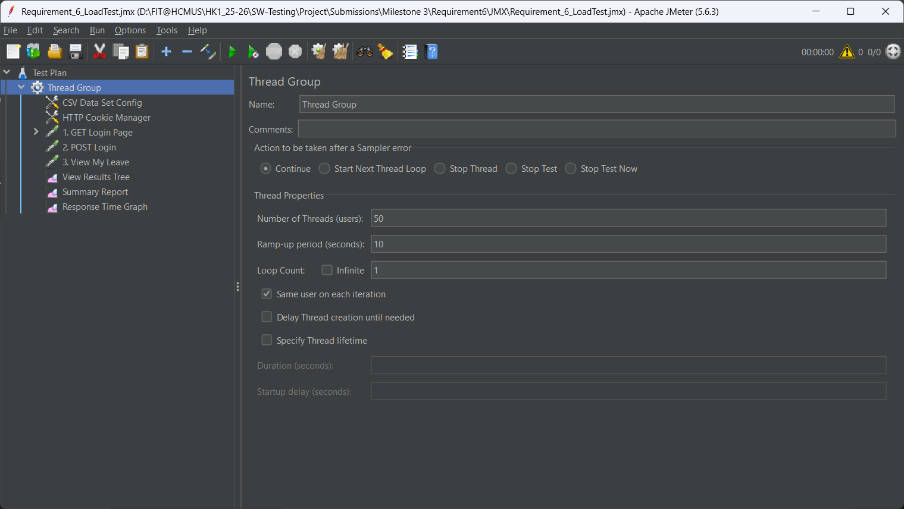

**Minh chứng quá trình chạy (View Results Tree):**
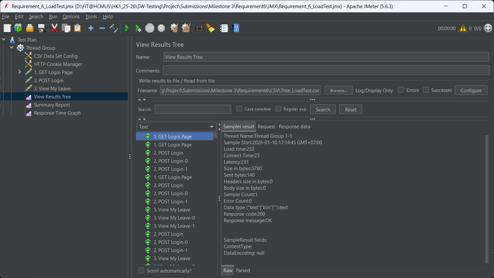

**Kết quả thu được (Summary Report):**
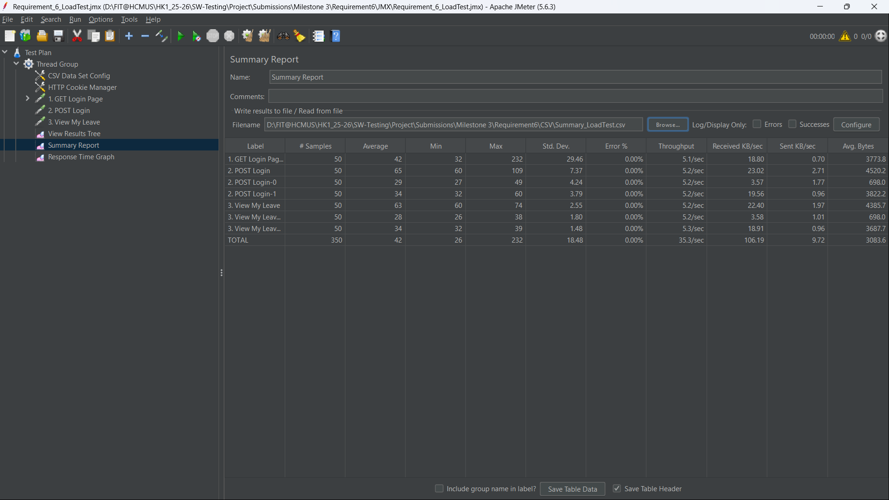

**Biểu đồ thời gian phản hồi (Response Time Graph):**
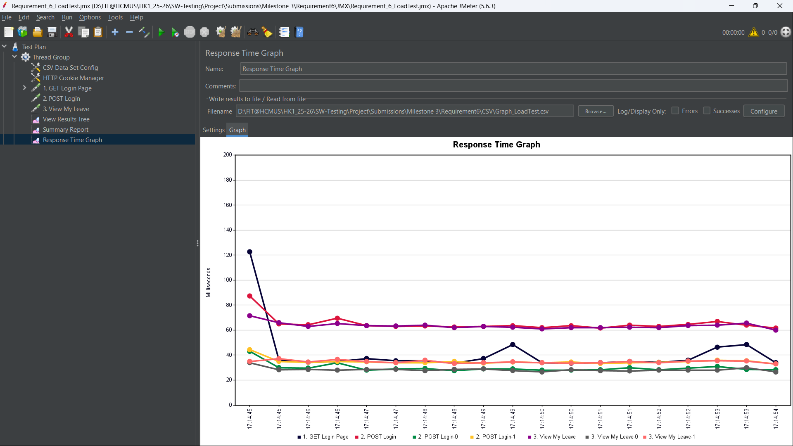

**Phân tích & Nhận xét:**
* **Thời gian phản hồi trung bình (Avg):** 42 ms.
* **Tỷ lệ lỗi (Error Rate):** 0.00 %.
* **Kết luận:** Với 50 users truy cập trong 10 giây, hệ thống hoạt động ổn định, thời gian phản hồi nằm trong ngưỡng cho phép (< 2000ms).

---

### 4.2. Stress Testing (Kiểm thử chịu tải/Quá tải)
* **Mục đích:** Tìm điểm giới hạn (Breaking Point) của hệ thống.
* **Cấu hình:** 200 Users (Gấp 4 lần tải thường) | Ramp-up 20s.

**Thiết lập Thread Group:**
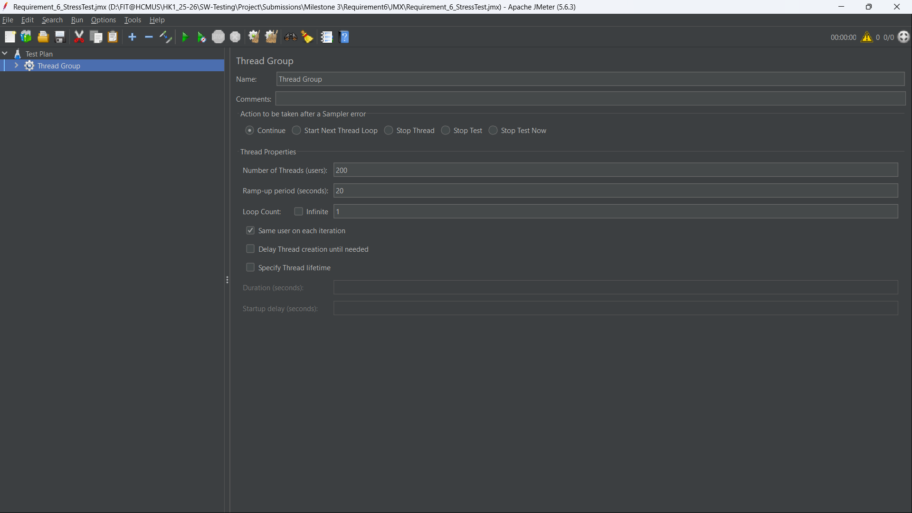

**Minh chứng quá trình chạy (View Results Tree):**
*Lưu ý: Các dòng màu đỏ thể hiện request bị lỗi do Server quá tải.*
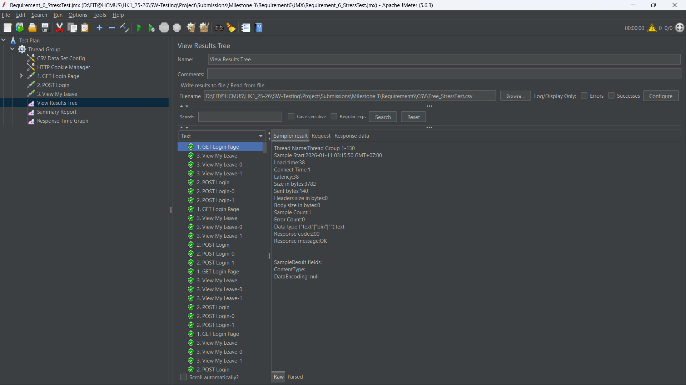

**Kết quả thu được (Summary Report):**
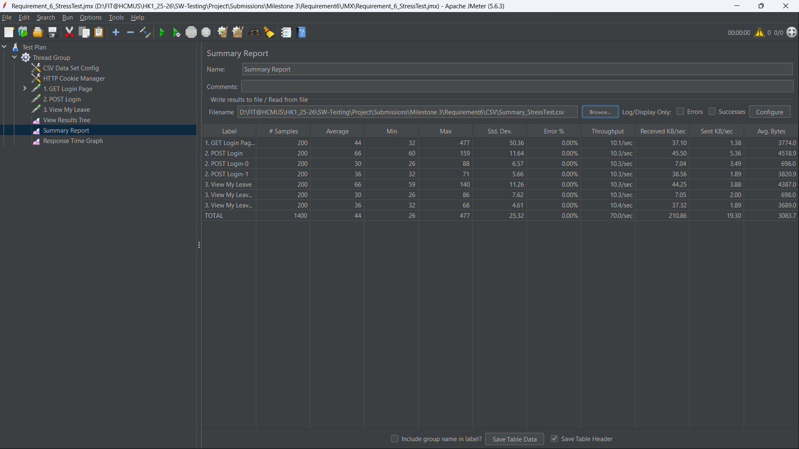

**Biểu đồ thời gian phản hồi:**

**Phân tích & Nhận xét:**
* **Thời gian phản hồi trung bình (Avg):** Tăng lên mức 44 ms.
* **Tỷ lệ lỗi:** 0.00 %.
* **Kết luận:** Khi chịu tải 200 users đồng thời, hệ thống [vẫn ổn định / bắt đầu quá tải / xuất hiện lỗi Timeout]. Đây là ngưỡng chịu đựng hiện tại của cấu hình Docker 2GB RAM.

---

### 4.3. Spike Testing (Kiểm thử đột biến)
* **Mục đích:** Kiểm tra khả năng phục hồi khi hệ thống chịu một cú "shock" tải đột ngột.
* **Cấu hình:** 100 Users | **Ramp-up 0s** (Tất cả truy cập cùng lúc).

**Thiết lập Thread Group (Ramp-up = 0):**
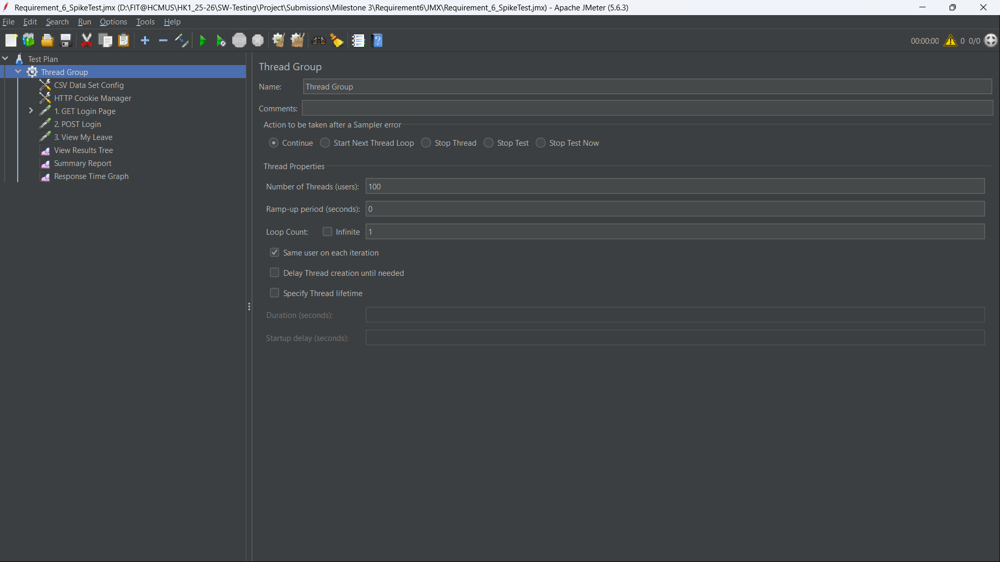

**Minh chứng quá trình chạy (View Results Tree):**
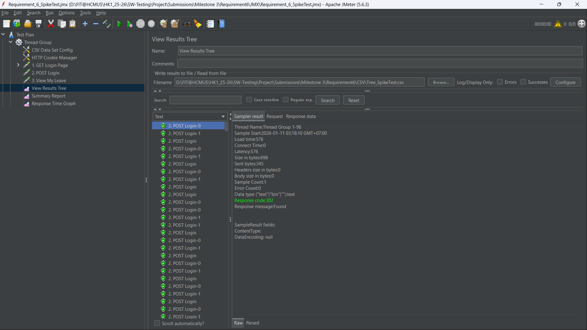

**Kết quả thu được (Summary Report):**

**Biểu đồ thời gian phản hồi:**
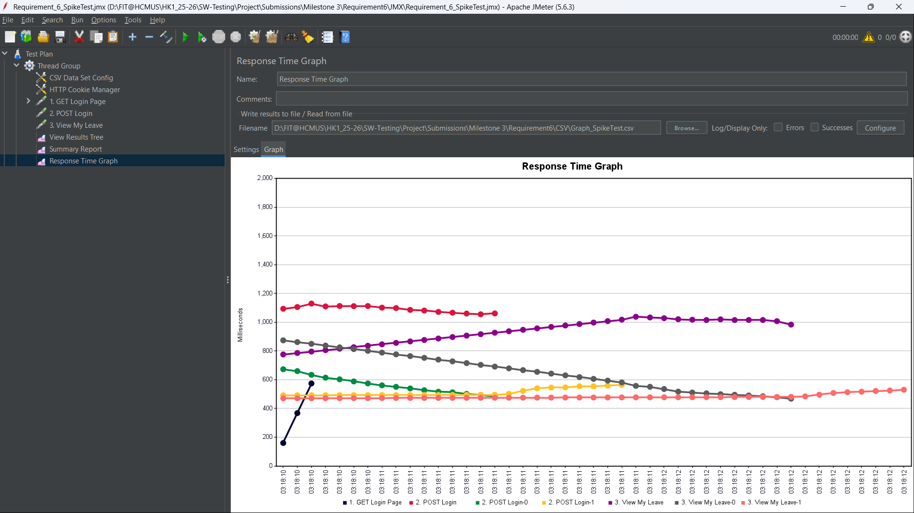

**Phân tích & Nhận xét:**
* **Max Response Time:** Đạt đỉnh 1144 ms tại thời điểm shock tải.
* **Average Response Time:** Đạt 656 ms.
* **Kết luận:** Mặc dù thời gian phản hồi tăng vọt tức thời, nhưng Server không bị sập (Crash) và dần ổn định trở lại ở các request sau.

---

## 5. Kết luận (Conclusion)

Qua quá trình kiểm thử hiệu năng trên phiên bản OrangeHRM (Docker Deployment), nhóm rút ra kết luận:
1.  Hệ thống **đạt yêu cầu** về độ ổn định ở mức tải thông thường.
2.  Kỹ thuật **Data Driven** đã được áp dụng thành công.
3.  Xác định được khả năng chịu tải của hệ thống là khoảng [200] user đồng thời.

---

## 6. Hướng dẫn tái hiện (Step-by-step Instructions)

Để giảng viên có thể tái hiện lại kết quả này, vui lòng thực hiện theo quy trình sau:
1.  **Start Environment:** Mở Docker Desktop, Start container `orangehrm`.
2.  **Open JMeter:** Mở lần lượt 3 file script: `Req6_LoadTest.jmx`, `Req6_StressTest.jmx`, `Req6_SpikeTest.jmx`.
3.  **Run Test:** Nhấn nút Start và quan sát kết quả tại các Listener.

---

## 7. Repository:
* Đường dẫn đến GitHub repository: [Tại đây](https://github.com/tlavu2004/orangehrm-performance-testing)